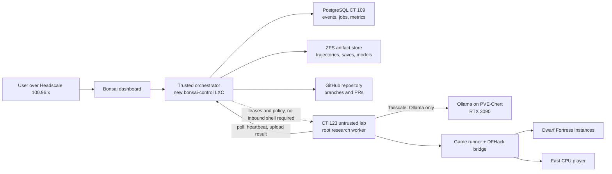
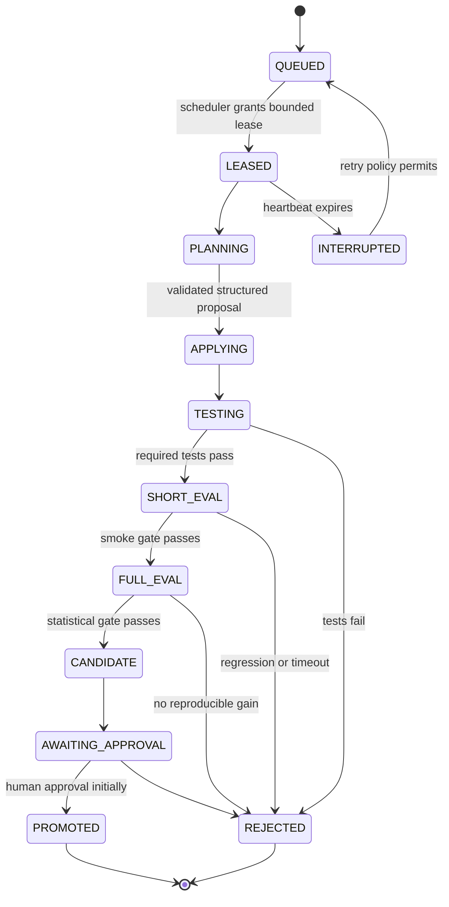

# Bonsai Dwarf Fortress — architecture draft

Status: discussion draft, 2026-07-18. No new service or container is authorized by this document.

## Goals

- Keep the GPU research agent autonomous enough to edit code and run experiments.
- Keep the fast in-game player independent of the large LLM during normal play.
- Make every job, model request, tool call, experiment, metric, artifact, and Git change observable.
- Preserve evaluation results and audit history even if the research agent has root inside its lab LXC.
- Expose the human dashboard only through the Headscale tailnet already used by `PVE-Chert` (`100.96.0.x`).

## Trust boundary

The research agent must not share a trust boundary with its evaluator, durable audit database, GitHub credential, or emergency stop mechanism.

Recommended split:

1. `CT 123 df-bonsai` becomes the **untrusted lab**.
   - Dwarf Fortress and DFHack.
   - Game runner and DFHack bridge.
   - Research worker with root inside this LXC.
   - OpenCode or another coding backend talking to Ollama.
   - CPU player, trainers, temporary worktrees, episode scratch data.
   - No GitHub credential, database owner credential, hidden evaluation seeds, or control-plane secret.
2. A new small `bonsai-control` LXC becomes the **trusted control plane**.
   - Durable orchestrator and scheduler.
   - Self-tracking WebUI.
   - Git publisher and clean repository mirror.
   - Artifact store and retention policy.
   - Public evaluator now; protected evaluator and hidden seeds later.
   - Tailscale endpoint for the user and for outbound polling by the lab.
3. Existing `CT 109 postgresql` stores durable metadata and the append-only event ledger.
   - Only `bonsai-control` connects to it.
   - `df-bonsai` never receives PostgreSQL credentials.
4. Ollama remains on `PVE-Chert` with the RTX 3090.
   - Current endpoint: port `11434`.
   - Current server: Ollama `0.11.10`.
   - Current model: `qwen3:30b`, Q4_K_M.



## Why the control plane is separate

Unix users inside one LXC are not a security boundary against an agent with root. If the WebUI, database credentials, evaluator, and GitHub token lived in `df-bonsai`, the agent could modify its score, erase failed experiments, rewrite the dashboard, or push directly to `main`.

The lab is allowed to be messy and self-modifying. The control plane is deliberately boring, version-pinned, and human-controlled.

## Durable orchestration loop

The LLM does not directly decide which daemon or experiment starts next. It may propose work, but the orchestrator owns the durable state machine and resource policy.

Job lifecycle:



Scheduler priority:

1. Honor global `PAUSED` or `EMERGENCY_STOP` state.
2. Recover interrupted jobs whose retry budget remains.
3. Run already approved evaluation or promotion work.
4. Select the highest-priority objective whose dependencies are complete and whose resource budget fits.
5. Ask the research model for one bounded hypothesis only when no concrete job is already ready.
6. Validate the proposal against editable paths, time/token/episode limits, and allowed tools.
7. If nothing is runnable, remain idle instead of inventing endless work.

The model can call a `propose_job` tool, but only the scheduler can turn a proposal into a lease.

## Research worker

Recommended first coding backend: a pinned OpenCode release, used headlessly and hidden behind our own `AgentBackend` interface.

Reasons:

- it has a local HTTP/OpenAPI server mode;
- it supports an Ollama OpenAI-compatible endpoint;
- it already provides repository-aware coding tools;
- the adapter lets us replace it with Aider or a custom Ollama tool loop without changing the orchestrator.

Initial model configuration should use the already installed `qwen3:30b`, then run a small coding benchmark before selecting or downloading a coder-specific model. Start with a 16k–32k context and explicit JSON schemas for planning results.

The worker receives a job envelope:

```json
{
  "job_id": "uuid",
  "base_commit": "sha",
  "objective": "one testable change",
  "editable_paths": ["bridge/", "player/", "tests/"],
  "required_tests": ["unit", "bridge-smoke"],
  "wall_time_seconds": 3600,
  "llm_request_limit": 40,
  "episode_budget": 20,
  "promotion_mode": "draft_only"
}
```

It returns a patch or Git bundle, structured result, logs, and artifact hashes. It does not push to GitHub.

## Game runner and bridge

The game runner is a separate local service inside `df-bonsai` even though the research worker has root there.

Responsibilities:

- create an isolated episode instance from the immutable `/srv/df-bonsai/current` release;
- allocate a unique loopback DFHack RPC port;
- start, health-check, pause, advance, save, and stop DF;
- enforce episode time and resource limits;
- expose a stable API such as `reset`, `observe`, `act`, `advance`, and `close`;
- write append-only local trajectory chunks and upload completed chunks to the control plane;
- never expose raw DFHack RPC to Tailscale or VLAN10.

The first bridge should expose semantic observations and actions, not keyboard presses or screenshots.

## Database and artifacts

PostgreSQL stores metadata, relationships, queue state, and small structured results. It should not store multi-gigabyte saves, trajectories, or model checkpoints directly.

Initial tables:

- `objectives`, `jobs`, `job_dependencies`, `job_leases`;
- `agent_runs`, `llm_calls`, `tool_calls`;
- `experiments`, `episodes`, `metrics`, `baselines`;
- `artifacts`, `artifact_refs`;
- `git_changes`, `commits`, `promotion_requests`;
- `approvals`;
- append-only `events` with actor, timestamp, payload, and hashes.

Large data goes to a content-addressed ZFS-backed artifact directory on `bonsai-control`:

- compressed JSONL or Parquet trajectories;
- save templates and failed saves;
- benchmark reports;
- training datasets;
- model checkpoints and exported ONNX files;
- raw logs retained according to policy.

PostgreSQL stores the SHA-256, size, media type, producing job, retention class, and filesystem location. MinIO is unnecessary for the MVP; the artifact API can be replaced by S3-compatible storage later.

The lab uploads artifacts through a bounded API. It can append claims, but only the trusted evaluator can write authoritative evaluation events.

## Self-tracking dashboard

This is a custom Bonsai dashboard, not a generic LLM chat UI.

Recommended implementation: FastAPI + Pydantic + SQLAlchemy/Alembic + server-rendered Jinja/HTMX, with SSE for live events. This keeps the first version small and inspectable.

Pages:

- **Overview** — global mode, current objective, active lease, game/Ollama health, recent failures.
- **Objectives** — dependency graph, priorities, blocked reasons, proposed future jobs.
- **Jobs** — state, heartbeat, budget consumption, retries, structured decision summary.
- **Experiments** — baseline versus candidate metrics, seeds, confidence and rejection reason.
- **Episodes** — timeline, semantic actions, rewards, terminal condition, artifact links.
- **Git** — base commit, diff, generated commits, branch/PR link, promotion status.
- **Models** — Ollama model, context, request duration, token counts and GPU availability.
- **Artifacts** — saves, trajectories, datasets, reports, checksums and retention class.
- **Control** — pause, resume, cancel lease, approve promotion, emergency stop.

There should be no browser shell or arbitrary command box in the MVP.

## Tailscale network

The host has two separate overlay clients. Bonsai deliberately uses the same Headscale instance as the host's `tailscale1` interface:

- `tailscale0`: a separate overlay, `PVE-Chert = 100.64.0.1`; not used by Bonsai;
- `tailscale1`: Headscale at `https://vpn.humaneconomy.ru`, tailnet `chert`, `PVE-Chert = 100.96.0.4`.

Registered Headscale identities are `bonsai-control = 100.96.0.6`, `df-bonsai = 100.96.0.7`, and `bonsai-db = 100.96.0.8`, owned by the separate Headscale user `bonsai`. The global Headscale policy is currently allow-all, so sensitive services also enforce their trust boundary locally: PostgreSQL's tailnet firewall accepts port 5432 only from `100.96.0.6`.

Proposed identities:

- `tag:bonsai-lab` for CT 123;
- `tag:bonsai-control` for the trusted control LXC.

Conceptual grants:

- the user's devices may reach `bonsai-control` WebUI and SSH;
- `bonsai-lab` may reach `bonsai-control` job/artifact API;
- `bonsai-lab` may reach `PVE-Chert:11434` and nothing else on the tailnet;
- `bonsai-control` does not need inbound shell access to the lab because the lab polls for leases;
- VLAN10 remains blocked from the LAN except for any single, explicitly approved database path from control to `192.168.0.109:5432`.

The first dashboard can bind HTTP only to its Tailscale address because WireGuard already encrypts the path. HTTPS can later be added with Caddy and an internal certificate; Tailscale Serve's automatic `*.ts.net` certificates should not be assumed for the separate Headscale network.

## GitHub workflow

Approved repository name: `bonsai-dwarf-fortress`, private.

The user authenticates with `gh auth login` only on the trusted control LXC. The lab never receives this credential.

Workflow:

1. Control plane creates a clean work branch from the recorded base commit.
2. Lab receives a credential-free worktree snapshot.
3. Lab returns a patch/Git bundle and artifacts.
4. Control plane applies it in a clean clone and runs trusted checks.
5. Passing candidates are committed and pushed as `agent/run-<job-id>`.
6. The dashboard links the experiment to the commit and pull request.
7. Initially only the user merges to `main`.

Git stores source, migrations, prompts, skill definitions, test code, and small configuration. Saves, trajectories, wiki dumps, datasets, and checkpoints stay in the artifact store.

The account uses GitHub Free, so GitHub cannot enforce protected `main` rules for this private personal repository. The trusted publisher therefore enforces the following application policy:

- automatic pushes are limited to `refs/heads/agent/*`;
- non-fast-forward pushes and branch deletions are never issued;
- `main` is updated only by a separate promotion command after a durable human approval event from the dashboard;
- the publisher logs the exact old and new commit IDs;
- a daily local `git bundle` backup preserves all canonical refs independently of GitHub.

This is an application guarantee rather than a GitHub server-side guarantee. The lab agent still has no GitHub credential. GitHub Pro branch protection or a GitHub App can be added later without changing the lab protocol.

## Suggested repository layout

```text
AGENTS.md
program.md
architecture/
control_plane/
lab_worker/
game_runner/
bridge/
player/
skills/
curricula/
evaluator_public/
db/migrations/
docs/
tests/
```

Private evaluator code and hidden seeds must not be cloned into the lab repository.

## MVP implementation order

1. Approve the trust split and provision `bonsai-control`.
2. Join the Bonsai LXC nodes to the host's Headscale network and enforce service-local restrictions until the shared ACL policy is reviewed.
3. Create the dedicated PostgreSQL database and migrations.
4. Build orchestrator state machine, event ledger, heartbeat, pause, and emergency stop.
5. Build the first dashboard over synthetic jobs.
6. Initialize the private GitHub repository and publisher flow.
7. Add lab polling and an OpenCode/Ollama smoke job that edits a trivial test repository.
8. Build the game runner and stable DFHack bridge.
9. Add one deterministic 30-day scenario and a rules-based CPU baseline.
10. Enable autonomous draft branches; keep promotion manual.

## Proposed defaults awaiting approval

- New control LXC: VMID `124` (confirmed as the next free ID during the audit), hostname `bonsai-control`, Debian 13, unprivileged.
- Resources: 4 vCPU, 8 GiB RAM, 500 GiB expandable ZFS root disk.
- Network: VLAN10 plus the host's Headscale tailnet; no GPU and no host bind mounts.
- Database: reuse CT 109 with a dedicated `bonsai` database; no direct lab access.
- Dashboard: FastAPI + HTMX, visible only over Tailscale.
- Coding backend: pinned OpenCode behind an adapter, existing `qwen3:30b` first.
- Autonomy: automatic planning/testing/short evaluation and draft branch creation; manual merge/promotion.
- Repository: `bonsai-dwarf-fortress`, private — approved; GitHub Free application-enforced promotion policy.
